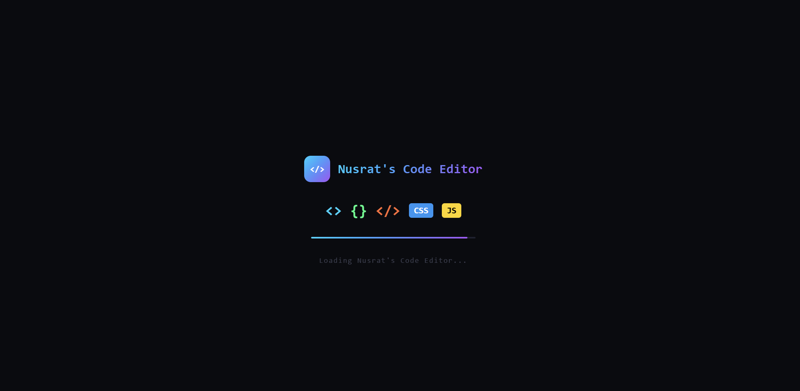
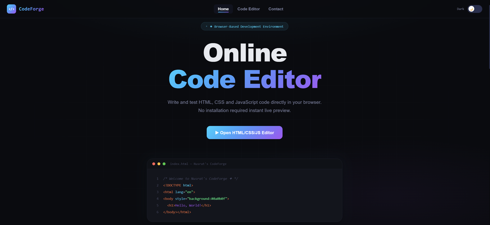
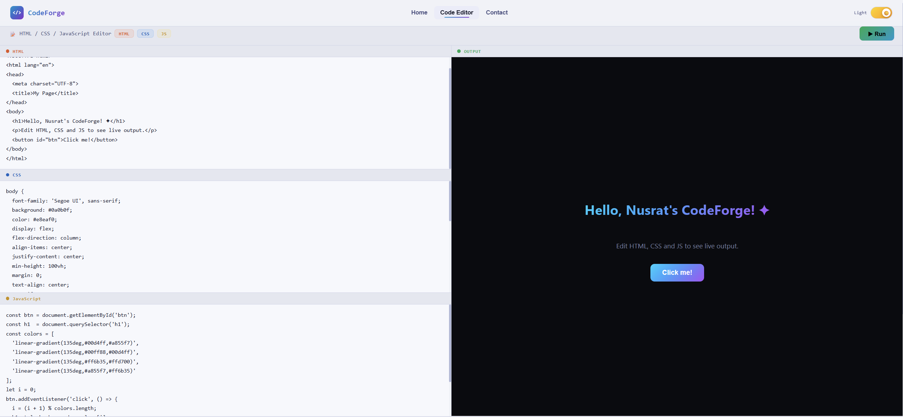
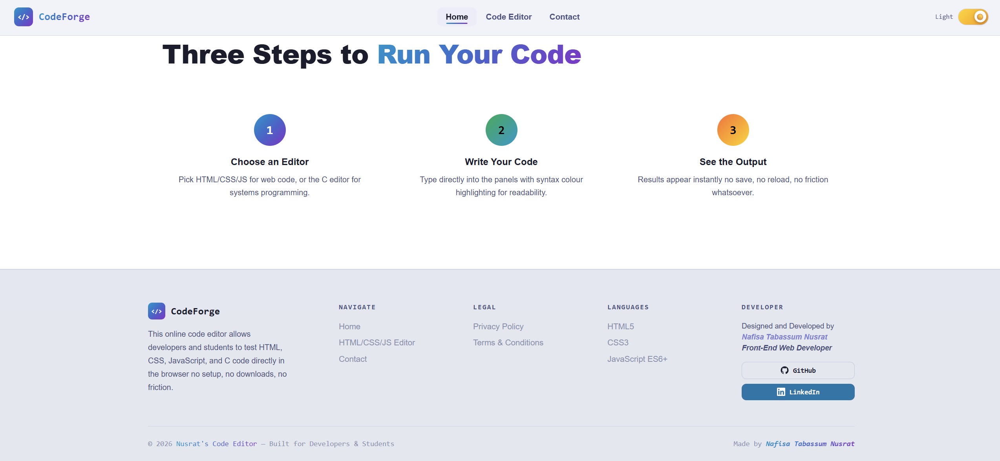
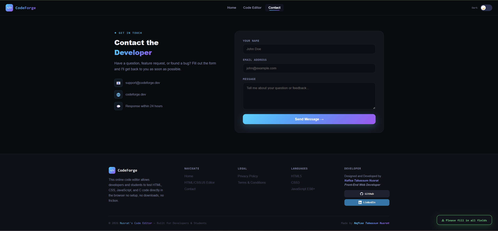

# CodeForge - Nusrat's Code Editor
 

  

# 💻 Nusrat's Code Editor – CodeForge
### Write, Test, and Preview Your Code Instantly

A browser-based code editor where users can write HTML, CSS, and JavaScript and instantly preview their website in real time.

---

# 🚀 About The Project

**CodeForge – Nusrat's Code Editor** is a browser-based coding environment that allows users to write and test **HTML, CSS, and JavaScript directly in the browser**.

Users can type their code and instantly see the output in a live preview window. This makes it easier for beginners, students, and developers to quickly test ideas and build small web projects.

The goal of this project is to provide a **simple and lightweight online coding environment** for learning and experimenting with front-end development.

---

# ✨ Key Features

### 💻 Online Code Editor
Write HTML, CSS, and JavaScript directly in the browser.

### ⚡ Live Preview
Instantly preview your website output as you write code.

### 🎨 Clean Developer Interface
Simple and user-friendly interface for coding.

### 📱 Responsive Design
Works smoothly on desktop, tablet, and mobile devices.

### 🧠 Beginner Friendly
Perfect for students and beginners learning web development.

---

# 🛠 Tech Stack

### Frontend
- HTML5  
- CSS3  
- JavaScript  

### Editor Features
- Live Code Rendering
- Real-time Preview
- Browser-based Coding Environment

---

# 📸 Project Preview

### Code Editor Interface

Add your project screenshot here.

Example:

---

# 🎯 Project Purpose

The main goals of this project are:

- Help beginners practice **web development easily**
- Provide a **quick environment for testing code**
- Allow users to **see instant website previews**
- Encourage learning through experimentation

---

# 🔮 Future Improvements

Planned updates for the project:

- Save code functionality
- Download project files
- Multiple layout themes
- Syntax highlighting
- Support for additional programming languages

---

# 👩‍💻 Developer

**Nafisa Tabassum Nusrat**

Front-End Developer passionate about building tools that help people learn and practice programming more easily.

---

# ⭐ Support

If you like this project, consider giving it a **star ⭐ on GitHub**.# CodeForge---Nusrat-s-Code-Editor
# CodeForge---Nusrat-s-Code-Editor
# nafisatabassumnusrat-CodeForge---Nusrat-s-Code-Editor
